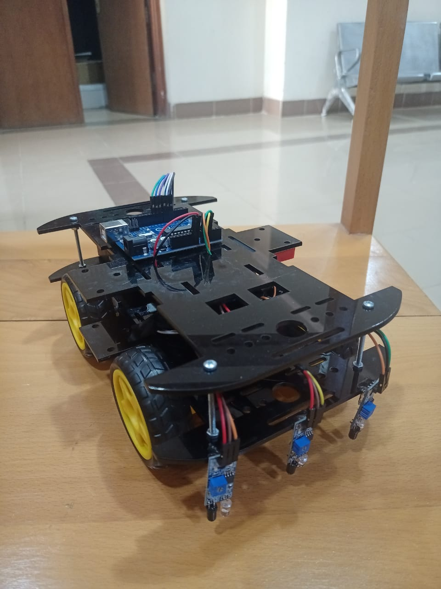
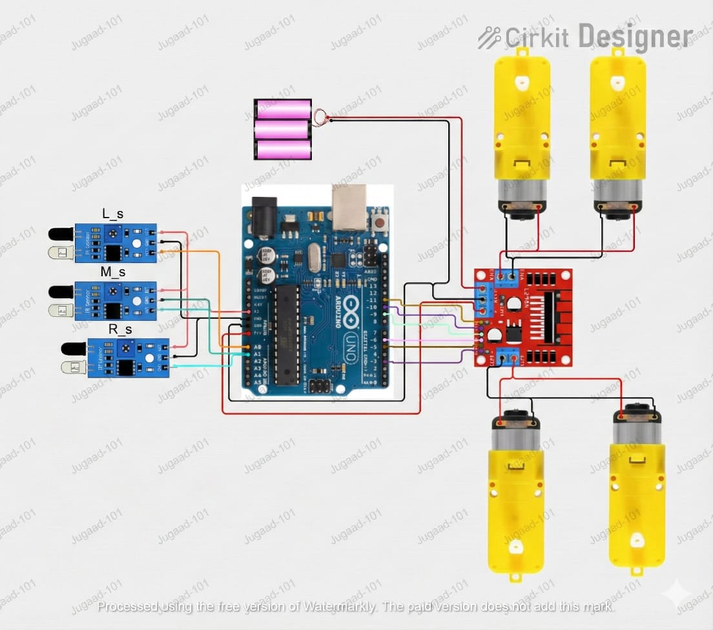

# 🏎️ Arduino Line Follower Robot (4WD)

A robust, 4-wheel drive Line Follower Robot powered by an **Arduino Uno**. This project utilizes 3 IR sensors to detect the track line and an L298N motor driver to control the DC motors with precise PWM speed adjustments.

## 📸 Project Demo

| **Real World View** | **Circuit Diagram** |
|:-------------------:|:-------------------:|
|  |  |
| *The assembled 4WD Chassis* | *Wiring Schematic* |

---

## 🌟 Features

* **Multi-Directional Control:** Forward, Left, Right, and Stop logic.
* **Speed Control (PWM):** Uses Pulse Width Modulation to control motor speed for smooth turns.
* **3-Sensor Logic:** Uses Left, Middle, and Right IR sensors for accurate line tracking.
* **Variable Speeds:** Different speeds defined for straight paths (`N_speed`), sharp turns (`R_speed`), and slow corrections (`F_speed`).

---

## 🛠️ Components Required

| Component | Quantity | Description |
| :--- | :---: | :--- |
| **Arduino Uno** | 1 | The brain of the robot. |
| **L298N Motor Driver** | 1 | Dual H-Bridge driver for DC motors. |
| **IR Sensors** | 3 | Infrared line tracking modules (TCRT5000). |
| **DC Gear Motors** | 4 | Yellow gear motors (TT Motors). |
| **Wheels** | 4 | Rubber wheels for grip. |
| **Chassis** | 1 | Acrylic 4WD Chassis kit. |
| **Batteries** | 3 | 18650 Li-ion batteries (recommended 12V total). |
| **Jumper Wires** | - | Male-to-Male & Male-to-Female. |

---

## 🔌 Circuit & Wiring

Based on the provided code (`src/main.cpp`), connect the components as follows:

### 1. L298N Motor Driver to Arduino
| L298N Pin | Arduino Pin | Function |
| :--- | :--- | :--- |
| **ENA** | `Pin 5` | Speed Control (PWM) - Motor Side A |
| **IN1** | `Pin 6` | Direction Control - Motor A |
| **IN2** | `Pin 7` | Direction Control - Motor A |
| **IN3** | `Pin 8` | Direction Control - Motor B |
| **IN4** | `Pin 9` | Direction Control - Motor B |
| **ENB** | `Pin 10` | Speed Control (PWM) - Motor Side B |

### 2. IR Sensors to Arduino
| Sensor | Arduino Pin | Description |
| :--- | :--- | :--- |
| **Left Sensor** | `A3` | Detects left turns |
| **Middle Sensor** | `A2` | Keeps the robot centered |
| **Right Sensor** | `A1` | Detects right turns |
| *VCC / GND* | *5V / GND* | Power for sensors |

### 3. Power Connections
* **Battery (+)** -> L298N `12V` Input.
* **Battery (-)** -> L298N `GND`.
* **L298N `GND`** -> Arduino `GND` (**Common Ground is critical**).
* **L298N `5V`** -> Arduino `VIN` or `5V` (Only if battery > 7V and < 12V).

---

## 💻 Code Explanation

The logic is straightforward and relies on reading digital signals from the IR sensors:

1.  **Variable Definitions:** We define pins and speed constants (`N_speed`, `R_speed`, `F_speed`).
2.  **`setup()`:** Initializes motor pins as `OUTPUT` and sensor pins as `INPUT`.
3.  **`loop()`:** Continuously reads the sensors:
    * **Forward:** Only Middle Sensor sees the line `(0 1 0)`.
    * **Left Turn:** Left Sensor sees the line `(1 0 0)` or `(1 0 1)`.
    * **Right Turn:** Right Sensor sees the line `(0 0 1)` or `(1 0 1)`.
    * **Stop:** All sensors see the line (Intersection) `(1 1 1)`.

> **Note:** The code assumes `1` (HIGH) means "Line Detected" (Black) and `0` (LOW) means "Surface" (White). If your sensors act differently, flip the logic or adjust the potentiometer.

---

## 🚀 How to Run

1.  **Assembly:** Build the chassis and mount motors/sensors.
2.  **Wiring:** Follow the wiring table above carefully.
3.  **Code Upload:**
    * Open `Arduino IDE`.
    * Copy the code into a new sketch.
    * Connect Arduino via USB.
    * Select correct Board and Port.
    * Click **Upload**.
4.  **Calibration:**
    * Place robot on the track.
    * Adjust the **blue potentiometer** on the IR sensors until the LED turns on/off correctly when passing over the black line.

---

## ⚠️ Troubleshooting & Notes

* **Wheels spinning backward?** Do not change the code! Simply swap the two wires connected to that specific motor at the L298N terminal.
* **Robot moving too fast/slow?** Adjust the values of `N_speed`, `R_speed`, and `F_speed` in the code (Range: 0 - 255).
* **Erratic Movement?** Check if the "Common Ground" wire connects the Battery Negative to Arduino GND.
* **Sensors not working?** Ensure they are not exposed to direct sunlight, as it interferes with IR signals.

---

### 👤 Author

Developed with ❤️ by <h4>Med7at Sharaf<h4>.
Feel free to fork this repository and improve it!
